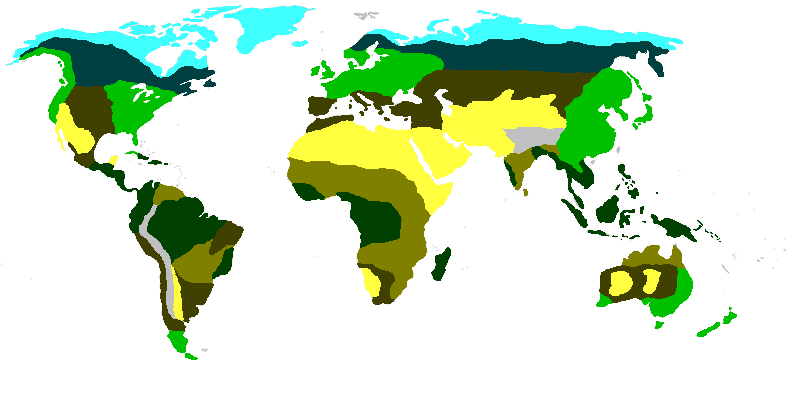

# El Dorado - A Mapmaker for the Unartistic

Software for making professional looking maps without the hassle of drawing it yourself. Takes in an assortment of input
data to create a clean readable map. Excellent for things like table to scenarios.

## Features

### Regions and Glyphs

Using the following biome bitmap of earth and the following json configuration file:



```json
{
  "#40ffff": {},

  "#00c000": {
    "outline_thickness": 1,
    "glyph_image": "samples/tree_glyph.png",
    "glyph_density": 75
  },

  "#004040": {
    "color": "00404080"
  },

  "#404000": {
    "glyph_image": "samples/grass_glyph.png",
    "glyph_density": 95
  },

  "#ffff40": {
    "color": "#ff8000",
    "glyph_image": "samples/sand_glyph.png",
    "glyph_density": 50,
    "glyph_threshold": 99
  },

  "#004000": {
    "outline_thickness": 2,
    "outline_color": "#ff00e7"
  },

  "#808000": {},

  "#c0c0c0": {
    "glyph_image": "samples/peak_glyph.png",
    "glyph_density": 90,
    "glyph_threshold": 80
  }
}
```

images such as this can be quickly produced. As you can see the shading of the regions can be changed (including transparency) and the regions may be outlined with different colors. Furthermore some glyphs have been added to random spots in some regions.


### Roads and Paths

### Topographical Mapping

Topographical images can be generated from monochrome heightmaps. The following heightmap of the earth will demonstrate
the different mapping techniques available for describing topographical data.


#### Contour Lines

The following shows the given height map divided into 32 different evenly space contour lines.


#### Tanaka Contour Lines

Tanaka Contours are the same as normal ones except that they are shaded differently based on an imaginary light source.
This gives an illusion of depth.


#### Monochrome Relief Shading

Shading every pixel in the heightmap according to some imaginary light source also gives an impression of depth.


## Planned Features

* Better region glyph distribution